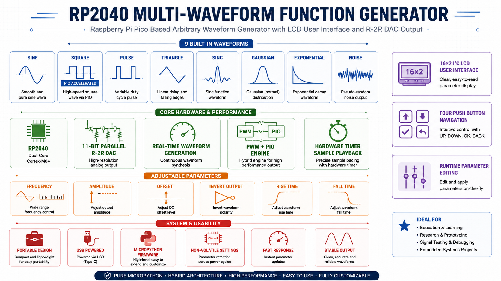
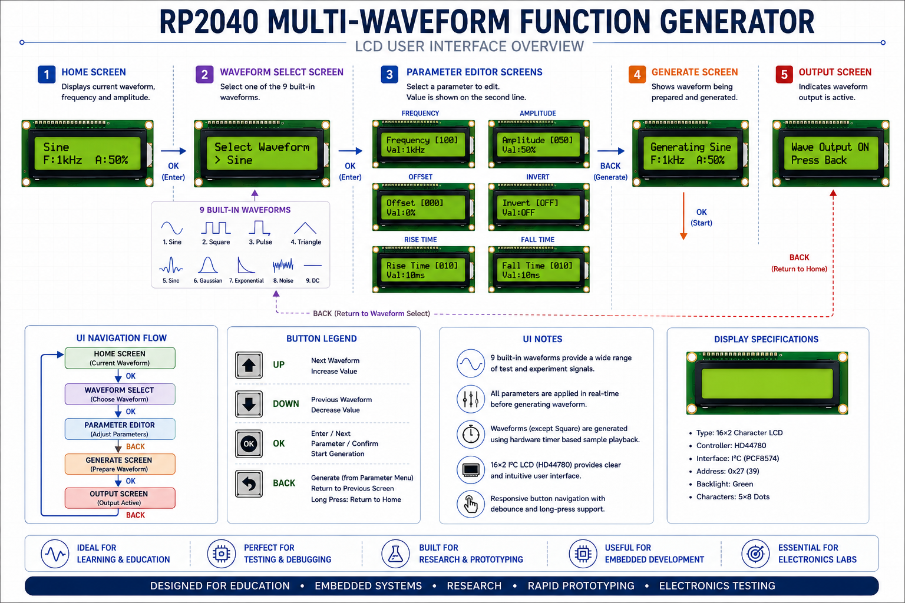

# Raspberry Pi Pico Arbitrary Waveform Generator (AWG)

A compact, low-cost electronic signal generator prototype designed around the RP2040 microcontroller. This project demonstrates high-speed digital-to-analog conversion using Programmable I/O (PIO) state machines, an R-2R resistor-ladder DAC network, and a menu-driven 16x2 LCD interface.

<div align="center">
  
  <br><em>Hardware Prototype Build</em>
</div>

---

## 📌 Project Overview

Commercial arbitrary waveform generators often cost hundreds of dollars. This engineering prototype explores building a versatile desk instrument capable of producing analog waveforms for circuit testing, frequency-response analysis, and general laboratory experiment use.

<div align="center">
  
  <br><em>Clean overview of the assembled prototype</em>
</div>

---

## ✨ Core System Features

<div align="center">
  
</div>

- **Multi-Waveform Signal Synthesis:** Support for 9 standard waveform geometries (Sine, Square, Pulse, Triangle, Sinc, Gaussian, Exponential, Noise, DC).
- **Dual-Mode Generation Architecture:**
  - High-Speed Pulse/Square Generation via RP2040 PIO state machines.
  - Multi-Bit Analog Waveform Streaming via R-2R resistor-ladder DAC.
- **On-Device User Interface:** 16x2 character LCD display showing real-time waveform selection, frequency settings, and menu parameters.
- **Tactile Button Control:** Dedicated push-buttons for menu navigation, frequency adjustment, and parameter stepping.

---

## 🖥️ On-Device User Interface

The instrument provides live visual feedback through a 16x2 character LCD, driven via a PCF8574 I2C adapter. Four tactile push-buttons handle menu navigation (UP, DOWN, OK/Menu, BACK), waveform selection, and frequency stepping.

<div align="center">
  
  <br><em>16x2 LCD menu interface showing waveform and frequency parameters</em>
</div>

---

## 📐 System Architecture

The instrument separates digital control logic, high-speed waveform execution, and analog signal reconstruction into modular functional blocks:

<div align="center">
  
  <br><em>System block diagram</em>
</div>

```text
┌─────────────────────────────────────────────────────────────┐
│                     USER INTERFACE LAYER                    │
│   [ Tactile Buttons ]   ──►   [ 16x2 Character LCD ]        │
│   (Menu Nav / Freq)           (I2C Display Adapter)         │
└──────────────────────────────┬──────────────────────────────┘
                               │
                               ▼
┌─────────────────────────────────────────────────────────────┐
│                  EMBEDDED CONTROLLER (RP2040)               │
│   - System Control Loop & Menu State Machine                │
│   - PIO State Machine (High-Speed Pulse / Clock Output)     │
│   - Multi-Bit Waveform Lookup Tables                        │
└──────────────────────────────┬──────────────────────────────┘
                               │
                               ▼
┌─────────────────────────────────────────────────────────────┐
│                 ANALOG OUTPUT CONDITIONING                  │
│   [ GPIO Digital Lines ] ──► [ R-2R Ladder Network ]        │
│                                      │                      │
│                                      ▼                      │
│                             [ Signal Output BNC/Terminal ]  │
└──────────────────────────────┬──────────────────────────────┘
```

---

## 📑 Hardware Components & Bill of Materials (BOM)

| Component Category | Description | Primary Role |
|:---|:---|:---|
| **Microcontroller** | Raspberry Pi Pico (RP2040) | Core processor, PIO signal engine, UI menu logic |
| **Display** | 16x2 HD44780 LCD with PCF8574 I2C Adapter | Visual parameter feedback (Waveform, Frequency, Step) |
| **User Input** | 4x Momentary Push Buttons | Navigation (UP, DOWN, OK/Menu, BACK) |
| **DAC Array** | Precision Resistor Ladder Network (R-2R Configuration) | Digital-to-Analog voltage synthesis |
| **Signal Output** | BNC Connector / Output Terminal Post | Interface to oscilloscopes and test circuits |
| **Power Supply** | USB 5V Bus Power | System power source |

---

## 📊 Technical Specifications & Design Targets

> ℹ️ **Design Target Notice:** Specifications listed below represent architectural design targets established during hardware modeling and prototyping.

| Specification | Parameter Target | Status / Notes |
|:---|:---|:---|
| **Microcontroller Core** | Dual-core ARM Cortex-M0+ @ 133 MHz | RP2040 Silicon |
| **Waveform Output Types** | 9 Geometries | Sine, Square, Pulse, Triangle, Sinc, Gaussian, Exp, Noise, DC |
| **Target Frequency (Square Wave)** | 1 Hz to 10 MHz | High-speed clock/pulse output generated via RP2040 PIO state machine |
| **Target Frequency (Arbitrary Waves)** | ~1 Hz – 300 Hz (estimated, hardware-unverified) | CPU/Timer-paced sample table streaming via R-2R DAC network |
| **Digital-to-Analog Resolution** | Multi-Bit R-2R Ladder Network | Parallel GPIO array |
| **Display Refresh Rate** | ~10 Hz Parameter Updates | Event-driven UI update loop |
| **Operating Voltage** | 3.3V Logic / 5V Bus | Standard USB supply |

---

## 🧪 Testing & Signal Validation

<div align="center">
  
  <br><em>Live signal validation on a digital storage oscilloscope</em>
</div>

Empirical oscilloscope captures and per-waveform validation results are compiled in the **[Complete AWG Waveform Validation Report](media/Test%20Result/Complete_AWG_Waveform_Validation_Report.pdf)**. Individual capture results for each waveform geometry are available in the [`media/Test Result/`](media/Test%20Result) folder.

> 🛠️ **Documentation in Progress** — Output linearity measurements and harmonic distortion audits are being compiled for future publication.

---

## 🎬 Demonstration Media

> 📹 **Demo Video Coming Soon** — Video clips showing live menu navigation, waveform switching, and frequency adjustments on a digital storage oscilloscope will be added in a future showcase update.

---

## 💡 Architectural Lessons & Future Enhancements

### Key Architectural Insights
1. **Offloading Timing to PIO:** Relying on standard CPU execution loops for high-frequency signal generation causes output jitter during display updates. Offloading clock and pulse synthesis to dedicated RP2040 PIO state machines guarantees stable signal timing.
2. **R-2R Ladder Topology Requirements:** Accurate binary-weighted digital-to-analog conversion requires strict 1:2 resistor value ratioing (R and 2R values, such as 1kΩ and 2kΩ). Using identical resistor values across all branches distorts output voltage steps regardless of component precision.

### Planned System Roadmap
- **Active Output Buffer:** Addition of an operational amplifier buffer stage to lower output impedance and prevent signal sagging under load.
- **Variable Amplitude & Offset Control:** Hardware-based digital potentiometer integration for adjustable gain and DC offset adjustment.
- **PCB Fabrication:** Transitioning from breadboard prototyping to a custom 2-layer printed circuit board enclosure.

---

## 🔧 Applications

<div align="center">
  
  <br><em>Typical applications of an arbitrary waveform generator</em>
</div>

This instrument is suitable for a range of bench and educational use cases, including:

- **Circuit & amplifier testing** — characterizing frequency response and transient behavior.
- **Sensor & transducer simulation** — emulating real-world signal sources.
- **Frequency-response analysis** — driving filters and resonant networks across a swept band.
- **Educational demonstrations** — visualizing waveform mathematics and signal theory.
- **Embedded system stimulus** — providing clock, pulse, and reference signals for development and debug.

---

## 📄 License & Rights Statement

This repository is published solely for demonstration, architectural review, and portfolio evaluation purposes. All rights reserved. Refer to the [LICENSE](LICENSE) file for complete terms.
